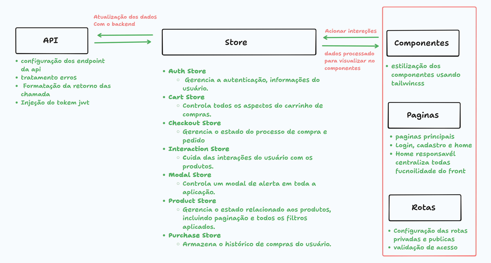

# E-Commerce - Front-End

O projeto de aplicação front-end de E-Commerce, com design responsivo utilizando tecnologias como Tailwind CSS e algumas funcionalidades essenciais. As tecnologias base de sua construção foram React, Vite, TypeScript e Zustand.

## Visão Geral

Este projeto é uma implementação simplificada de cliente para uma loja online. Ele oferece uma experiência de usuário fluida e interativa, desde a navegação e filtragem de produtos até o processo de checkout seguro. A arquitetura foi projetada para ser modular, escalável e de fácil manutenção.

### Gerência de estado

A utilização do Zustand, por conta de adota uam forma simples sem a  criar uma "store" (um contêiner de estado e ações), utilizando apenas a função create. Não há necessidade de Context.Providers, actions e reducers em arquivos separados, como é comum em outras bibliotecas como Redux. A forma simple de separar cada store de forma modular sendo fácil encontrar e modificar lógicas de estado, pois elas estão contidas em seus próprios módulos. E um ponto importante, são os middlewares como o persist é usado para sincronizar o estado da store com o localStorage.
O uso do TailwindCss foi pela agilidade e também para testar a tecnologias em si, a configuração e bem simples e uso não é complexo e torna rapido a estilização, ainda cheguei a cogita o uso scss module, mas seria bem mais custoso.
Não utilizei o reack-Hook-form por conta inicialmente não considerei adicionar as validações nos campos, mas depois vir a necessidade mas tinha feito de forma bem manual e tinha pouco tenho para refatoraçoões e deixei como está.      

## Detalhes do planejamento


<p align="center">
    <apan align="center">
      
    </apan>
</p>

## ✨ Funcionalidades Principais

  * **Autenticação de Usuário**: Sistema completo de Login e Cadastro de novos usuários utilização tokem jwt.
  * **Navegação Protegida**: Acesso a páginas restritas somente para usuários autenticados, com redirecionamento automático.
  * **Listagem de Produtos Dinâmica**:
      * Busca por nome.
      * Filtros por faixa de preço minimo e maximo, origem do produto Brasileiro/Europeu e por desconto.
      * Ordenação por preço (menor para o maior e vice-versa).
      * Paginação para uma navegação eficiente entre os produtos.
  * **Carrinho de Compras Interativo**: Adicione, remova e visualize produtos em um carrinho de compras que atualiza o valor total em tempo real. O estado do carrinho persiste mesmo se a página for recarregada.
  * **Painel de Favoritos**: Salve seus produtos preferidos em um painel de acesso rápido.
  * **Histórico de Compras**: Visualize todas as suas compras anteriores em um painel dedicado.
  * **Avaliação de Produtos**: Deixe sua avaliação nos produtos comprados, na seção historico de comprar (apenas nota).
  * **Modal de Detalhes do Produto**: Clique em um produto para ver mais informações em um modal detalhado, nome, descrição, esconto e origem.
  * **Modal de Detalhes do Produto historio de visualização recentes**: Clique em um card de produto para ver o detalhes, aparti da segunda visualição será mostrado historico dos produtos visualizados.
  * **Processo de Checkout**: Um formulário de checkout para simular a comprar para pix e cartão.

## 🚀 Tecnologias Utilizadas

O projeto foi construído utilizando um conjunto de ferramentas modernas:

  * **Framework**: [React](https://reactjs.org/)
  * **Build Tool**: [Vite](https://vitejs.dev/)
  * **Linguagem**: [TypeScript](https://www.typescriptlang.org/)
  * **Gerenciamento de Estado**: [Zustand](https://github.com/pmndrs/zustand)
  * **Roteamento**: [React Router DOM](https://reactrouter.com/)
  * **Cliente HTTP**: [Axios](https://axios-http.com/) (com interceptors para autenticação automática)
  * **Estilização**: [Tailwind CSS](https://tailwindcss.com/)

## 🏗️ Estrutura do Projeto

A estrutura de pastas foi organizada para promover a separação de responsabilidades e a escalabilidade.

```
/src
├── /api           # Lógica de comunicação com o backend (Axios, services)
├── /components    # Componentes React reutilizáveis (ProductList, Cart, etc.)
├── /pages         # Componentes de página (Home, Login, Register)
├── /routes        # Lógica de roteamento, incluindo rotas protegidas
├── /store         # Gerenciamento de estado global com Zustand (stores)
├── /types         # Definições de tipos e interfaces do TypeScript
├── /utils         # Funções utilitárias (ex: validação de formulários)
├── App.tsx        # Componente raiz que define as rotas
├── main.tsx       # Ponto de entrada da aplicação
└── index.css      # Estilos globais
```

### Principais Diretórios

  * **`src/api`**: Isola toda a comunicação com a API externa. `axios.config.ts` injeta automaticamente o token de autenticação em cada requisição.
  * **`src/components`**: Contém todos os blocos de construção da UI. Cada componente tem sua própria pasta, promovendo a modularidade.
  * **`src/pages`**: Estrutura as principais telas da aplicação, compondo os componentes menores.
  * **`src/store`**: O cérebro da aplicação. Cada "slice" do estado (autenticação, carrinho, produtos) é gerenciado em seu próprio arquivo, utilizando o padrão de hooks do Zustand. Utiliza `persist` para salvar estados importantes no `localStorage`.

## Como Executar

1.  Clone o repositório.
    ```bash
    git clone https://github.com/erikbernard/ecommerce.git
    ```
2.  Prencha o .env
    ```bash
    PORT=3001
    PREVIEW_PORT=3001
    ORIGIN=http://localhost:3001
    BASE_URL=http://localhost:3000
    VITE_API_URL=http://localhost:3000
    ```
3.  Instale as dependências:
    ```bash
    npm install
    ```
4.  Inicie o servidor de desenvolvimento:
    ```bash
    npm run dev
    ```
5.  Abra [http://localhost:5173](https://www.google.com/search?q=http://localhost:5173) (ou a porta indicada no seu terminal) no seu navegador.